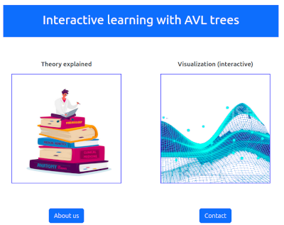
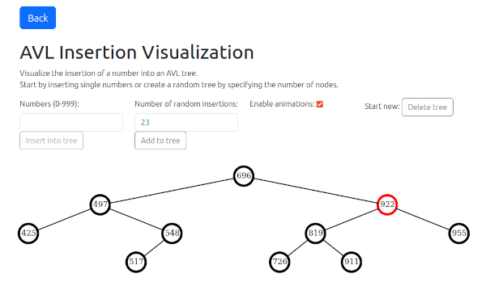

# WebTree and Flask Presentation

These were our two projects in lecture "web engineering 1" at Mosbach university. It uses Bootstrap for CSS and vanilla JS with a canvas element to draw the AVL tree.

## The AVL tree website

In folder *webseite*.

The startpage

The AVL tree page

You can input numbers manually or choose a number for the amount of numbers which should be inputted randomly.

## Flask Presi

In folder *flask_presi*.