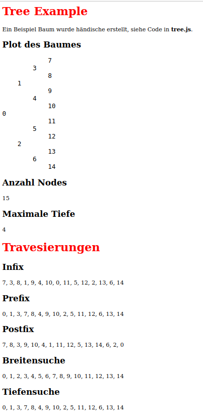

# webtree
Task for class Web Engineering

## Update 17.05.2023

Folgende Funktionen wurde schon implementiert in JS Code:

- Anzahl Nodes
- Maximale Tiefe
- Infix
- Prefix
- Postfix
- Breitensuche
- Tiefensuche
- Plot des Baumes

## Beispiel der index.html

